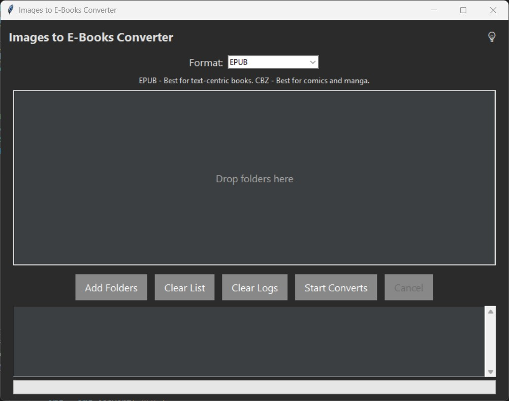

# Image Folder to E-Books Converter

A user-friendly desktop application to convert folders of images (like comics or manga chapters) into beautiful, seamless `EPUB` / `CBZ` files, perfectly formatted for e-readers like Kobo and Kindle.



---

## ✨ Features

- **User-Friendly Interface:** 
   -  A clean, modern, and intuitive UI.
- **Drag & Drop:**
   -  Easily add multiple folders by dragging them directly into the application.
- **Batch Processing:**
   -  Convert hundreds of folders in a single click.
- **Optimized for E-readers:**
   -  Automatically formats the EPUB to prevent extra blank pages between images.
- **No Index Page:** 
   -  Generated EPUBs flow directly from one image to the next without an intrusive table of contents.
- **Real-time Logging:**
   -  See the status of your conversions as they happen.
- **Standalone Executable:**
   -  Can be easily compiled into a single `.exe` file for distribution.
- **Light & Dark Mode:**
   -  Toggle between light and dark themes with a single click — fully integrated into the interface.
- **CBZ Output Option:**
  - Choose between EPUB and CBZ formats depending on your reading platform.
---

## 📂 Supported File Formats
The application can process all common image formats, including:
- `jpg`
- `jpeg`
- `png`
- `gif`
- `bmp`
- `webp`

---

## 🚀 Quick Start (For Users)
This is the easiest way to use the application without any programming knowledge.

1. Download the Application:
   - Go to the [Releases](https://github.com/Hakku99/folder-of-images-to-ebooks/releases/) page of this repository.
   - Under the `Latest Release`, find the `Assets` section and click on `Image.to.E-Books.Converter.exe` to download it.
2. Run the Application:
   - Double-click the downloaded .exe file to run.
   - Windows may show a security warning because it's a new application. If so, click `More info` and then `Run anyway`.
3. Use the Converter:
   - Drag and drop your image folders into the application window.
   - CLick on the light bulb button to trigger the color theme (`dark` or `light`).
   - Pick your desired output format (`epub` or `.cbz`).
   - Click the `Start Converts` button and choose where to save your files.
   - Enjoy!

---

## ❤️ Support This Project
If you find this application useful, please consider supporting its development by buying me a coffee!

[](https://ko-fi.com/hakku99)

---

## 🚀 Installation & Usage (From Source)

These instructions explain how to run the application directly from the source code.

### Prerequisites

-   Python 3.8 or newer
-   `pip` for installing packages

### 1. Clone the Repository

First, clone this repository to your local machine:

```bash
git clone https://github.com/Hakku99/folder-of-images-to-ebooks.git
cd folder-of-images-to-ebooks
```

### 2. Create `requirements.txt`

Create a file named `requirements.txt` in the project's root directory and add the following lines. This file lists all the necessary libraries.

```
Pillow
ebooklib
tkinterdnd2
```

### 3. Install Dependencies

Open your terminal or command prompt in the project directory and run the following command to install the required libraries:

```bash
pip install -r requirements.txt
```

### 4. Run the Application

Once the dependencies are installed, you can run the application with this command:

```bash
python image-to-ebooks.py
```
*(This assumes your main Python script is named `image-to-ebooks.py`)*

The application's graphical user interface should now appear.

---

## 📦 How to Compile Python program into an EXE File

You can bundle this application into a single standalone executable (`.exe`) for Windows, so it can be run without needing Python installed.

### 1. Install PyInstaller

If you don't already have it, install `PyInstaller`, a tool for converting Python scripts into executables:

```bash
pip install pyinstaller
```

### 2. Run the Build Command

From your terminal, in the project's root directory, run the following command:

```bash
pyinstaller --onefile --windowed --name="Image to E-Books Converter" --icon=icon.ico image-to-ebooks.py
```
**Command Breakdown:**
-   `--onefile`: Bundles everything into a single executable file.
-   `--windowed`: Prevents the command-line console from appearing when the app runs.
-   `--name="Image to E-Books Converter"`: Sets the final name of your `.exe` file.
-   `--icon=icon.ico`: (Optional) If you have an icon file named `icon.ico` in the same directory, this will set it as the application's icon.

### 3. Find Your Executable

After the process completes, look for a new folder named `dist`. Your finished `Image to E-Books Converter.exe` will be inside this folder.

---

## 📜 License

This project is licensed under the MIT License. See the [LICENSE](LICENSE) file for details.
